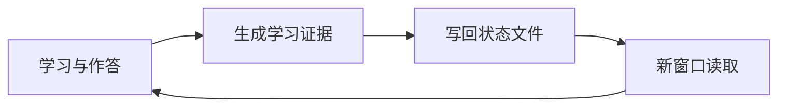

# Human Gradient Descent

> **讲义炼丹炉：碳基神经网络手动反向传播系统**  
> *Train yourself like a neural network.*

人脑也是神经网络，只是反向传播需要手动完成。

本项目是一套面向课程学习、考试复习与知识库建设的可复用工作流：把课件和习题作为训练数据，把做题视为前向传播，根据错题计算 Loss，再通过错因诊断完成反向传播和参数更新。经过多个 Epoch 后，将真正理解、测试并纠正过的内容压缩成可检索的开卷讲义。

这里不生产“看过等于学会”的学习幻觉。每个知识点都需要经过概念理解、题型识别、独立作答、错误诊断和迁移测试，才能被标记为掌握。

**Slides are datasets. Exercises are training loops. Mistakes are gradients. Exams are inference.**

| 碳基训练过程 | 神经网络术语 |
|---|---|
| 阅读课件与接收题目 | Input / Dataset |
| 尝试独立作答 | Forward Pass |
| 对照答案与评分 | Loss Calculation |
| 定位错误原因 | Backpropagation |
| 修改理解与解题方法 | Parameter Update |
| 进入下一轮复习 | Next Epoch |
| 只会原题、不会变式 | Overfitting |
| 能迁移到历年题 | Generalization |
| 正式考试 | Inference |

这是一个基于 **GPT + GitHub** 实际搭建和验证的空白课程学习模板。GitHub 保存课程资料与学习状态，GPT 负责讲解、测试、诊断以及文件系统管理。

## 1. 怎么使用

用户不需要理解或手动维护本仓库中的 YAML、Markdown 和目录结构。这些文件是 AI 使用的学习状态后端。

本项目采用双层指令架构：用户只用自然语言说明目标，AI 在后台把它转换为完整、严格的内部执行协议。**只要用户消息中出现“炼丹炉”三个连续汉字，AI 就必须先识别任务并给出简短路由回执。**用户不需要背诵动作名称、参数或文件路径。

最常用的五类表达是：

```text
炼丹炉，我已经上传资料了。
炼丹炉，带我学习这一章。
炼丹炉，考考我。
炼丹炉，把刚才的结果整理好。
炼丹炉，继续。
```

AI 随后会简短说明：识别出的任务、准备调用的内部协议、关键约束，以及是否存在一个必须确认的问题。判断明确且操作可撤销时，说明后直接执行。

采用相同工具链时可以直接使用：创建课程仓库，授予 GPT 对该仓库的读写权限，在聊天中上传课程资料，然后发送：

```text
炼丹炉，请接管这门新课程。
项目：https://github.com/你的用户名/你的课程仓库
我已经上传了现有资料，目标是完成课程学习与考试准备。
```

GPT 自动检查并创建缺失结构、整理上传资料、填写配置、建立状态并生成学习计划。用户不需要手动管理仓库文件。

之后每次打开新窗口，只需要把同一个 GitHub 仓库交给 GPT，然后说：

> 炼丹炉，继续。

AI 应自动读取断点、掌握度、错题和学习偏好，从上次停止的位置继续。用户始终只负责提供资料、作答和决定目标；文件分类、状态更新和会话交接全部由 AI 完成。

## 2. AI 内部读取顺序

以下步骤由 AI 自动执行，不是用户操作说明：

1. `AGENTS.md`
2. `config/course.yaml`
3. `status/mastery.yaml`
4. `status/learner_profile.yaml`
5. `mistakes/mistakes.md`
6. `handoff/latest.md`
7. `output/openbook/`
8. `exam/exam_map.md`
9. 当前任务涉及的 `tests/`、`vocabulary/`、`kb/`、`exercise/`

不要只依据 `mastery.yaml` 判断掌握度；必须结合错题、测试记录和最近一次学习回执。

## 3. 核心工作流

```text
课件/习题/真题
  → 概念讲解
  → 学生复述或完成第一步
  → 分层提示与逐步解题
  → 小测和迁移题
  → 错误分类
  → 更新掌握度
  → 压缩进开卷材料
```

第二轮复习建议：闭卷回忆 → 题型识别 → 固定计算套路 → 独立习题 → 历年题迁移 → 综合测试 → 错因诊断 → 压缩开卷页。

## 4. 默认目录结构

普通使用者无需操作这些目录；本节供维护模板或审查 AI 写入结果时参考。以下是默认结构，不是不可修改的固定框架。AI 可以按课程需求增加普通文件或现有目录下的子目录；新增顶层目录必须有独立、长期且明确的职责。移动、重命名、合并或删除已有目录时，AI 必须先说明迁移逻辑、受影响引用和回滚方式，并取得确认。

| 路径 | 用途 |
|---|---|
| `commands/` | AI 使用的第二层完整指令映射；普通用户无需阅读或背诵 |
| `config/` | 课程目标、考试形式和协作设置 |
| `sources/` | 原始课件、习题、答案、真题；不在此改写原文件 |
| `kb/` | 按章节整理的详细知识库 |
| `exercise/` | 独立习题讲解与练习记录 |
| `exam/` | 历年题及“题目—知识点—章节”映射 |
| `tests/` | 无答案提示的小测、综合测验及作答记录 |
| `mistakes/` | 错题与错误类型诊断 |
| `vocabulary/` | 中英术语和常见英文题干 |
| `status/` | 掌握度、已验证的学习特征与最近学习状态 |
| `output/openbook/` | 高密度、可打印、双语开卷材料 |
| `handoff/` | 不同模型或新会话之间的只读交接 |

## 5. 内部文件命名

文件命名由 AI 负责：

- 章节知识库：`kb/ch01_topic.md`
- 独立习题：`exercise/ch01/ex_01.md`
- 测试：`tests/ch01_test_01.md`
- 开卷页：`output/openbook/ch01.md`
- 使用两位数字章节号，保证排序稳定。

## 6. 状态定义

- `PASS`：能独立识别题型并完成核心步骤。
- `PARTIAL`：理解主要概念，但仍需提示或容易计算出错。
- `REVISIT`：概念、识别或公式调用仍不稳定，需要重新学习。
- `NOT_STARTED`：尚无有效学习证据。

## 7. 支持范围

本仓库的参考实现和说明均以 **GPT + GitHub** 为准：

- GPT 读取 GitHub 中的状态和学习成果；
- 用户直接在聊天中发送课程资料；
- GPT 在本地或云端工作区处理资料；
- GPT 将更新后的知识库、错题、掌握度和交接记录写回 GitHub。

理论上，这套方法可以移植到 Gemini 等其他能够管理本地或云端文件系统的 AI，但需要根据具体模型的连接器、权限和指令机制单独适配，不能视为本仓库已经验证的开箱即用实现。

不建议让两个 AI 同时维护同一个学习项目。双 AI 并行容易造成状态冲突、重复记录、掌握度标准不一致和教学风格漂移。推荐始终保留一个 active writer；需要更换 AI 时，先完成交接记录，再由新的单一 AI 接管。

自然语言入口、路由回执和双层执行机制见 [`COMMANDS.md`](COMMANDS.md)。

## 8. 开卷材料原则

只收录已经理解、测试、纠正过且考试时能直接调用的内容。优先放：题型识别信号、关键公式、固定步骤、易混淆对比、典型错误和来源位置。详细推导留在 `kb/` 或 `exercise/`，不要把开卷页写成教材。

## 持久化学习与跨窗口恢复

本项目不会假设聊天窗口拥有永久记忆。它把掌握度、稳定学习特征、历史错因和最近进度写入持久化项目文件；新窗口按照固定顺序读取这些文件，从而恢复学习状态。



详细的首次配置、日常使用、状态写回和防止错误画像的方法，见 [`docs/WORKFLOW.md`](docs/WORKFLOW.md)。

## 9. License

本仓库中的学习框架、文档、提示词和 Markdown 模板采用 [Creative Commons Attribution-NonCommercial-ShareAlike 4.0 International](https://creativecommons.org/licenses/by-nc-sa/4.0/) 许可。

你可以出于非商业目的复制、修改和传播，但必须注明来源；公开传播修改版本时，必须继续采用相同或兼容许可。任何商业使用都需要事先取得作者的单独授权。课程课件、教材、历年试题、官方答案以及其他第三方材料不属于本授权范围，其著作权仍归各自权利人所有。详见 `LICENSE.md`。
