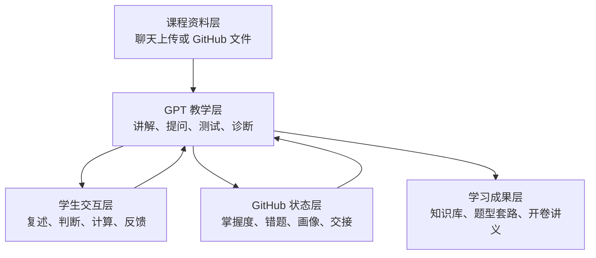
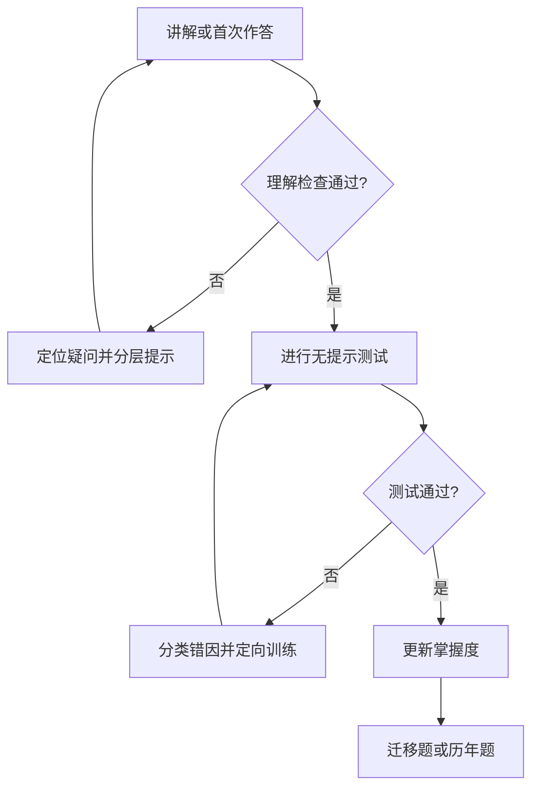
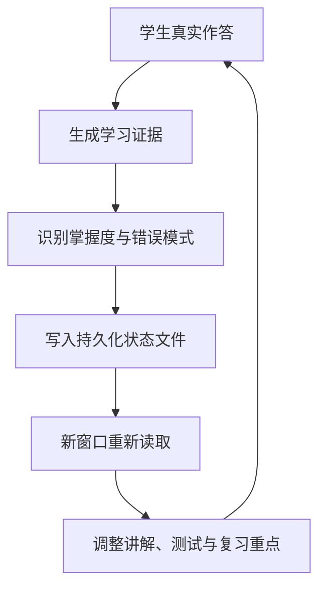

# 使用流程与持久化学习机制

## 1. 这个项目解决什么问题

普通 AI 学习对话有三个常见问题：

1. 新窗口不知道旧窗口学过什么；
2. AI 容易把“听懂讲解”误判为“已经掌握”；
3. 笔记、错题、测试和考试资料彼此分散，无法形成持续迭代的学习系统。

Human Gradient Descent 使用 GitHub 保存课程资料、学生作答、错因、掌握度和会话断点。GPT 每次开始学习前读取仓库状态，在本地或云端工作区处理用户上传的资料，结束后再将新证据写回 GitHub。因此，聊天窗口可以结束，但学习状态不会随窗口一起消失。

它不是让 GPT 获得永久记忆，而是让不同 GPT 窗口共享同一个可检查的 GitHub 状态仓库。

## 2. 系统架构

这张图说明系统由哪些部分组成，以及信息如何流动。



AI 不仅读取课件，还读取你的历史学习状态；学习结束后，也不只输出一段聊天，而是更新可以被下一窗口继续使用的文件。

## 3. 用户旅程

这张图说明用户从创建课程项目到参加考试的完整体验。


- 第一次使用：建立课程配置并登记资料来源。
- 日常学习：讲解、主动回忆、作答、测试和错因诊断。
- 阶段复习：根据掌握度和错误模式安排训练，而不是平均复习。
- 考试准备：连接知识点、独立习题和历年题，确定得分优先级。
- 最终输出：把经过理解、测试和纠正的内容压缩成可检索资料。

## 4. 第一次使用

项目中的文件结构是 GPT 的工作区，不是要求用户填写的表格。使用相同工具链时，用户通过指令完成部署：

```text
炼丹炉｜部署
模板来源：https://github.com/11111f11111/human-gradient-descent
目标项目：https://github.com/你的用户名/你的课程仓库
```

部署后，用户上传资料并发送：

```text
炼丹炉｜初始化
项目：https://github.com/你的用户名/你的课程仓库
目标：准备这门课程的学习与考试
资料：本次上传的全部文件
```

其余工作由 AI 自动完成：

- 识别资料类型并建立来源清单；
- 填写课程和考试配置；
- 建立章节与掌握度状态；
- 整理课件、习题和历年题之间的对应关系；
- 记录用户明确表达的语言与教学偏好；
- 给出第一阶段学习计划；
- 将所有结果写回项目目录。

用户可以检查这些文件，但正常使用不依赖手动修改它们。

## 5. 每次新窗口怎么开始

在新窗口中提供同一个 GitHub 仓库，并确认 GPT 具有读写权限，然后只需发送：

> 炼丹炉｜继续

AI 在后台自动执行：

1. `AGENTS.md`：工作和证据规则；
2. `config/course.yaml`：课程与考试约束；
3. `status/mastery.yaml`：章节掌握状态；
4. `status/learner_profile.yaml`：已经验证的学习特征；
5. `mistakes/mistakes.md`：历史错误和处理状态；
6. `handoff/latest.md`：上次会话的断点；
7. `output/openbook/`：已验证并压缩的内容；
8. `exam/exam_map.md`：历年题与知识点映射；
9. 当前任务涉及的知识库、习题、测试和原始资料。

上述文件名不需要用户记忆。AI 不能要求用户逐个打开、复制或维护这些文件。

AI 也不能只读取 `mastery.yaml`。掌握状态可能滞后，必须与近期测试、错题和会话交接相互核对，然后用简短语言向用户报告：

- 上次学到哪里；
- 当前最需要处理什么；
- 建议立即开始的任务。

## 6. 单个知识点如何训练

原始思维导图最适合描述这个局部循环，而不适合承担整个系统架构。



### 训练规则

1. AI 先提取已知条件、问题要求和题型识别信号。
2. 学生必须产生可检查的输出，例如复述、判断、第一步或完整计算。
3. 提示按“方向提示 → 公式提示 → 部分步骤”逐级增加。
4. 理解确认后进行不附答案提示的测试。
5. 错误归入 `CONCEPT`、`RECOGNITION`、`FORMULA`、`CALCULATION`、`LANGUAGE` 或 `RETRIEVAL`。
6. 只有独立完成并具备迁移证据，才标记为 `PASS`。
7. 只有经过理解、测试和纠正的内容，才能进入开卷材料。

## 7. 为什么新窗口不会从零开始



系统使用四层持久化结构：

| 层级 | 解决的问题 | 主要文件 |
|---|---|---|
| 课程事实 | 新窗口不知道课程范围和考试要求 | `config/course.yaml`、`sources/manifest.yaml` |
| 长期学习状态 | 不知道真正会什么、经常错什么 | `mastery.yaml`、`learner_profile.yaml`、`mistakes.md` |
| 短期会话断点 | 不知道上次讲到了哪里 | `handoff/latest.md` |
| 可复用学习成果 | 讲过的内容无法快速再次调用 | `kb/`、`exercise/`、`exam/`、`output/openbook/` |

每次结束较长会话时，AI 必须更新 `handoff/latest.md`：

- 本次完成内容；
- 支撑掌握判断的作答或测试证据；
- 尚未解决的问题；
- 下一次应该从哪里继续；
- 本次修改的文件。

GitHub 内容不会自动注入所有窗口。新窗口必须能够访问同一仓库，并遵守 `AGENTS.md` 和 `COMMANDS.md`；否则仍可能表现得像第一次见到用户。

其他 AI 理论上也可以采用“仓库链接 + 课程资料 + AI 管理文件系统”的方法，但必须针对其具体能力重新实现。本项目不保证其他 AI 直接兼容，且不支持 Gemini。

## 8. 为什么会“越用 AI，AI 越懂你”

AI 不是通过猜测性格来理解用户，而是不断积累经过验证的学习证据。

| 积累的证据 | 保存位置 | 下一次如何影响教学 |
|---|---|---|
| 已掌握、部分掌握和待复习内容 | `status/mastery.yaml` | 跳过无效重复，把时间放在薄弱点 |
| 稳定的语言和讲解偏好 | `status/learner_profile.yaml` | 调整讲解粒度、术语比例和提问方式 |
| 高频错误类型 | `mistakes/mistakes.md` | 优先检查真正的失分原因 |
| 最近进度和未完成任务 | `handoff/latest.md` | 新窗口直接从断点继续 |
| 题型与考试频率 | `exam/exam_map.md` | 按得分价值安排训练顺序 |
| 已验证的快速解题材料 | `output/openbook/` | 缩短考试时的检索路径 |

随着证据增加，AI 可以逐渐区分：

- 是概念不懂，还是没有识别出题型；
- 是公式不会，还是单纯计算失误；
- 是英文题干造成误判，还是知识本身缺失；
- 哪种解释真正帮助了作答，哪种解释只产生“听懂了”的感觉；
- 哪些内容需要重新训练，哪些内容只需快速复习。

所以，“越用越懂你”的实际机制是：**学习状态文件越来越准确，而不是模型凭空获得永久记忆。**

## 9. 系统边界与错误画像防护

持久化也可能把错误判断长期保留下来，因此必须设置约束：

- 只记录有实际作答、测试或用户明确陈述支持的结论；
- 区分一次偶然错误和稳定错误模式；
- 长期学习画像应记录证据和更新时间；
- `mastery.yaml` 必须与近期测试、错题和交接记录交叉核对；
- 用户可以随时修改或删除错误画像；
- 不记录与学习无关的敏感个人信息；
- 不把 AI 的推测写成用户事实；
- 不把第三方模型生成的内容未经核验直接写入正式知识库。

最小有效闭环是：

```text
读取状态 → 学习或做题 → 检查作答 → 分类错因 → 更新状态 → 写交接记录
```

只聊天而不写回，新窗口仍会遗忘；只写笔记而不测试，掌握度会逐渐失真。

## 10. 匿名化使用示例

下面的案例根据真实的多窗口课程复习经历抽象而成，但删除了课程名称、具体知识点、院校、成绩和个人身份信息。

### 背景

一名学生需要复习一门英文授课、包含选择题和计算题、允许携带自制资料的课程。资料包括多章课件、独立习题、官方答案和多年历年题。学生需要在多个 AI 窗口中连续学习，同时生成最终考试资料。

### 窗口一：建立课程地图

学生只在聊天中上传课件、习题和历年题，并说明考试目标。学生没有创建目录、填写 YAML 或维护进度表。AI 没有立即开始泛泛总结，而是在后台：

1. 在 `sources/manifest.yaml` 登记资料；
2. 建立章节知识库框架；
3. 将历年题映射到章节和知识点；
4. 初始化 `mastery.yaml`；
5. 记录学生希望中文讲解、保留英文术语等明确偏好。

会话结束时，AI 在 `handoff/latest.md` 记录已经整理的范围、仍缺少的资料以及下一窗口应开始的位置。

### 窗口二：根据真实作答诊断问题

新窗口先读取项目状态，因此不需要学生重新解释课程结构。学习过程中，学生能复述概念，但在题目变化后无法独立确定解题入口。

AI 没有简单记录“不会”，而是根据作答证据将问题归为 `RECOGNITION`，而不是 `CONCEPT` 或 `FORMULA`。随后它增加题型识别训练，并在 `mistakes.md` 中记录：

- 错误发生在哪类任务；
- 学生原来的判断；
- 正确识别信号；
- 下一次需要验证的迁移题。

对应章节被标记为 `PARTIAL`，没有因为学生听懂讲解就提前标记为 `PASS`。

### 窗口三：跨窗口继续训练

另一个新窗口读取 `mastery.yaml`、`mistakes.md` 和上次交接记录后，直接从未通过的迁移测试开始。学生这次成功识别题型，但计算中出现独立错误。

AI 因此将新的问题归为 `CALCULATION`，没有重复讲解整个概念。经过针对性测试后，章节状态才更新为 `PASS`，同时把稳定出现的学习模式写入 `learner_profile.yaml`。

这体现了“越用越懂你”：后续 AI 能区分“概念不会”“题型没认出”和“计算失误”，教学成本逐渐下降。

### 窗口四：考试前压缩

考试前，新窗口综合读取：

- 各章节掌握状态；
- 历年题出现频率；
- 尚未关闭的错题；
- 已通过测试的解题套路；
- 允许携带资料的限制。

AI 据此安排复习优先级，并只将已经验证的内容写入 `output/openbook/`：题型识别信号、必要公式、固定步骤、易混概念和常见错误。长篇推导保留在知识库，通过目录链接快速定位。

### 最终结果

整个过程中，聊天窗口多次更换，但学生不需要重复说明：

- 学到哪一章；
- 哪些内容已经掌握；
- 哪类错误经常出现；
- 哪种讲解方式更有效；
- 下一步应该做什么。

这些信息没有依赖某个窗口的临时记忆，而是由项目目录中的学习证据、状态文件和交接记录共同恢复。
